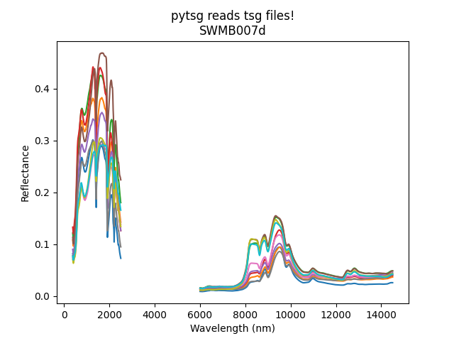

.. pytsg documentation master file, created by
   sphinx-quickstart on Wed Aug  3 19:56:09 2022.
   You can adapt this file completely to your liking, but it should at least
   contain the root `toctree` directive.

Welcome to pytsg's documentation!
=================================

The Sepctral Geologist (TSG) is an industry standard software for hyperspectral data analysis

https://research.csiro.au/thespectralgeologist/

**pytsg** is an open source one function utility that imports the spectral geologist file package into a simple object.

Thanks to CSIRO and in particular `Dr Andrew Rodger <https://people.csiro.au/R/A/Andrew-Rodger>`_
for assistance in decoding the file structures.

.. toctree::
   :maxdepth: 2
   :caption: Contents:
   :hidden:

   installation/installation
   quick-start/quick-start
   auto_examples/index
   api/modules
   glossary/glossary
